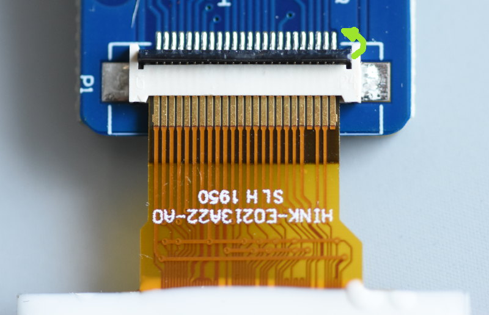

# GxEPD2
## Arduino Display Library for SPI E-Paper Displays

- With full Graphics and Text support using Adafruit_GFX
- For SPI e-paper displays from Dalian Good Display 
- and SPI e-paper boards from Waveshare

### important note :
- these displays are for 3.3V supply and 3.3V data lines
- never connect data lines directly to 5V Arduino data pins, use e.g. 4k7/10k resistor divider
- series resistor only is not enough for reliable operation (back-feed effect through protection diodes)
- 4k7/10k resistor divider may not work with flat cable extensions or Waveshare 4.2 board, use level converter then
- do not forget to connect GND

## Wiring an E-Paper Display

To connect an e-paper display, two steps are required:

1. Connect the display to the connector board
1. Connect the connector board to the microcontroller
1. Configure the connector board, if required (RESE switch on [DESPI-C02](despi-c02))

FPC connectors usually have some kind of locking mechanism like a part that has
to be pushed in to lock the connector. The [DESPI-C02][despi-c02] board has a
connector which has to be rotated by pushing it down to the PCB, as shown in
the pictures below.

| FPC connector open                | FPC connector closed                |
| ----                              | ----                                |
|  |  |

The following pins can be found on connector boards:

* BUSY
* RES or RST: Reset
* D/C or DC
* CS: Chip Select or Slave Select; the board only reads data when this is high
* SCK: Serial clock
* SDI: Serial data in, or MOSI (Master Out Slave In), i.e. data sent from the
  Arduino master to the board slave
* GND: Ground
* 3v3: 3.3 V

BUSY, RES, DC, and CS can be chosen freely. SCK and SDI are the standard SPI
communication pins on the Arduino. Their pin number can be obtained from the
respective data sheet.


## mapping suggestions

#### mapping suggestion from Waveshare SPI e-Paper to Wemos D1 mini
- BUSY -> D2, RST -> D4, DC -> D3, CS -> D8, CLK -> D5, DIN -> D7, GND -> GND, 3.3V -> 3.3V

#### mapping suggestion from Waveshare SPI e-Paper to ESP8266 NodeMCU:
- BUSY -> D2, RST -> D4, DC -> D3, CS -> D8, CLK -> D5, DIN -> D7, GND -> GND, 3.3V -> 3.3V

#### mapping suggestion from Waveshare SPI e-Paper to generic ESP8266
- BUSY -> GPIO4, RST -> GPIO2, DC -> GPIO0, CS -> GPIO15, CLK -> GPIO14, DIN -> GPIO13, GND -> GND, 3.3V -> 3.3V

#### mapping suggestion (by G6EJD) from Waveshare SPI e-Paper to ESP8266 Huzzah:
- BUSY -> 03, RST -> 15, DC -> 02, CS -> 00, CLK -> 14, DIN -> 13, GND -> GND, 3.3V -> 3.3V

#### mapping suggestion for ESP32, e.g. LOLIN32, see .../variants/.../pins_arduino.h for your board
- NOTE: there are variants with different pins for SPI ! CHECK SPI PINS OF YOUR BOARD
- BUSY -> 4, RST -> 16, DC -> 17, CS -> SS(5), CLK -> SCK(18), DIN -> MOSI(23), GND -> GND, 3.3V -> 3.3V

#### mapping suggestion for STM32F1, e.g. STM32F103C8T6 "BluePill"
- BUSY -> A1, RST -> A2, DC -> A3, CS-> A4, CLK -> A5, DIN -> A7

#### mapping suggestion for AVR, UNO, NANO etc.
- BUSY -> 7, RST -> 9, DC -> 8, CS-> 10, CLK -> 13, DIN -> 11

#### mapping suggestion for Arduino MEGA
- BUSY -> 7, RST -> 9, DC -> 8, CS-> 53, CLK -> 52, DIN -> 51

#### mapping suggestion for Arduino DUE
- BUSY -> 7, RST -> 9, DC -> 8, CS-> 77, CLK -> 76, DIN -> 75
- SPI pins are on 6 pin 2x3 SPI header

## connection scheme for (discontinued) DESTM32-S2 connection board for e-paper panels:

```
   connection to the e-Paper display is through DESTM32-S2 connection board, available from Good Display

   DESTM32-S2 pinout (top, component side view, solder side of connector):

         |-------------------------------------------------
         |  VCC  |o o| VCC 5V  not needed
         |  GND  |o o| GND     GND
         |  3.3  |o o| 3.3     3.3V
         |  nc   |o o| nc
         |  nc   |o o| nc
         |  nc   |o o| nc
   MOSI  |  DIN  |o o| CLK     SCK
   SS    |  CS   |o o| DC      e.g. D3
   D4    |  RST  |o o| BUSY    e.g. D2
         |  nc   |o o| BS      GND
         |-------------------------------------------------
```

[despi-c02]: http://www.e-paper-display.com/DESPI%20V2.0%20Specification8130.pdf
